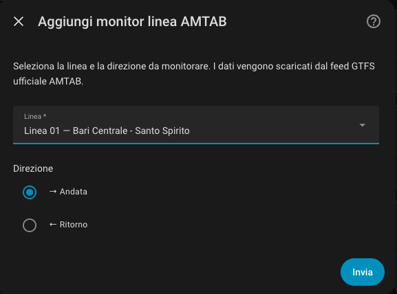
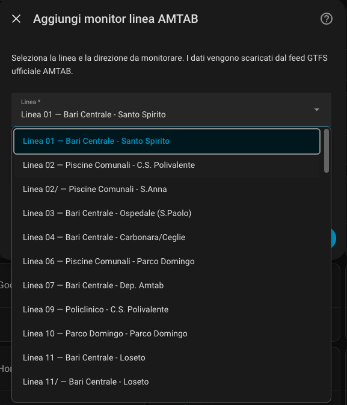
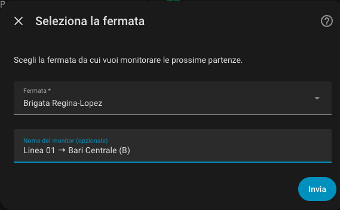
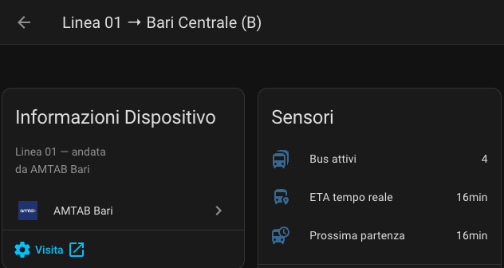

# AMTAB Bari for Home Assistant

[](https://github.com/hacs/integration)

> **Disclaimer:** This is an unofficial, community-made integration and is not affiliated with, endorsed by, or supported by AMTAB Bari. Use at your own risk.
>
> Integration implemented with help from [Claude](https://claude.ai).

A Home Assistant custom integration that brings real-time and schedule data from **AMTAB Bari** (the public bus operator in Bari, Italy) directly into your home automation system.

---

## Screenshots

| Setup | Select line |
|-------|---------------|
|  |  |

| Stop | Gate entity |
|-------------|------------|
|  |  |

## Features

- Downloads the official AMTAB GTFS feed automatically (routes, stops, schedules)
- **Real-time data**: live vehicle positions, delays, and ETA at your stop via the AMTAB GTFS-RT API
- Each configured monitor (line + stop + direction) creates one **device** with 3 sensors
- Multiple monitors supported simultaneously (e.g. outbound and return trip, two different stops)
- Designed for **automations**: get notified when your bus is 5 minutes away

---

## Sensors

Three sensors are created for each configured monitor:

| Sensor | Description | State |
|--------|-------------|-------|
| **Next departure** | Minutes until the next scheduled bus at your stop | Integer (min) |
| **Real-time ETA** | Minutes until the nearest approaching bus reaches your stop | Integer (min) |
| **Active buses** | Number of buses currently in service on the line | Integer |

### Attributes — Next departure

| Attribute | Description |
|-----------|-------------|
| `stop_name` | Name of the monitored stop |
| `route_name` | Line name |
| `direction` | `andata` (outbound) / `ritorno` (inbound) |
| `next_departure_time` | Next departure time (`HH:MM`) |
| `next_headsign` | Destination of the next bus |
| `upcoming_departures` | List of the next 5 scheduled departures |
| `gtfs_updated` | Timestamp of last GTFS feed refresh |

### Attributes — Real-time ETA

| Attribute | Description |
|-----------|-------------|
| `bus_id` | Vehicle identifier |
| `scheduled_arrival` | Scheduled arrival time at your stop (`HH:MM`) |
| `delay_seconds` | Current delay in seconds |
| `delay_minutes` | Current delay in minutes |
| `latitude` / `longitude` | Current vehicle position |
| `speed_kmh` | Current vehicle speed |
| `active_buses_on_line` | Total active buses on the line |
| `rt_updated` | Timestamp of last real-time update |

### Attributes — Active buses

| Attribute | Description |
|-----------|-------------|
| `buses` | List of all active buses with position, speed, and delay |
| `rt_updated` | Timestamp of last real-time update |

---

## Requirements

- Home Assistant 2024.1 or later
- Internet connection (to fetch GTFS data and real-time API)

---

## Installation

### Via HACS (recommended)

1. In HACS, open the 3-dot menu → **Custom repositories**
2. Add this repository URL with category **Integration**
3. Click **Download**
4. Restart Home Assistant

### Manual

1. Copy the `custom_components/amtab_bari/` folder into your HA `config/custom_components/` directory
2. Restart Home Assistant

---

## Setup

1. Go to **Settings → Devices & Services → Add Integration**
2. Search for **AMTAB Bari**
3. Select the **bus line** and **direction** (outbound / inbound)
4. Select the **stop** you want to monitor
5. Optionally give the monitor a custom name (e.g. `Bus to work`)

Repeat these steps to add more monitors (different lines, stops, or directions).

### Options

After setup, you can change the **update interval** (1–60 minutes, default: 1 min) via the integration's Configure button.

---

## Automation examples

### Notify when the bus is 5 minutes away

```yaml
automation:
  alias: "Bus to work arriving"
  trigger:
    - platform: numeric_state
      entity_id: sensor.linea_16_piazza_moro_real_time_eta
      below: 6
      above: 0
  condition:
    - condition: time
      weekday: [mon, tue, wed, thu, fri]
      after: "07:00:00"
      before: "09:30:00"
  action:
    - service: notify.mobile_app_my_phone
      data:
        title: "Bus arriving!"
        message: >
          Line 16 is {{ states('sensor.linea_16_piazza_moro_real_time_eta') }} minutes away.
          Scheduled departure: {{ state_attr('sensor.linea_16_piazza_moro_next_departure', 'next_departure_time') }}
```

### Alert when no service is scheduled

```yaml
automation:
  alias: "No buses today"
  trigger:
    - platform: state
      entity_id: sensor.linea_16_piazza_moro_next_departure
      to: "unknown"
  action:
    - service: notify.mobile_app_my_phone
      data:
        message: "No scheduled service for Line 16 today."
```

---

## Architecture

```
Home Assistant
      │
      │  One config entry = one monitor (line + stop + direction)
      ▼
AmtabCoordinator (per entry)
      │
      ├─► Static GTFS (shared cache, refreshed every 24h)
      │     https://www.amtabservizio.it/gtfs/google_transit.zip
      │
      └─► GTFS-RT API (refreshed every N minutes, default: 1 min)
            https://avl.amtab.it/WSExportGTFS_RT/api/gtfs
            ├─ /VechiclePosition?lineCode={line}
            └─ /TripUpdates?lineCode={line}
```

**No data is sent to any third party.** The integration only fetches public data from AMTAB's own servers.

---

## Troubleshooting

- **"Could not download GTFS data"** — check your internet connection. The GTFS feed is downloaded on startup and refreshed every 24 hours.
- **Real-time ETA always `unknown`** — there may be no active buses on the line right now, or the RT API is temporarily unavailable. The "Next departure" sensor (based on the schedule) always remains available.
- **Debug logs** — go to `Settings → System → Logs` and search for `amtab_bari`.

---

## Contributing

Pull requests are welcome. Please open an issue first for significant changes.

## License

MIT
